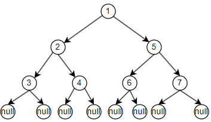

# 二叉树  
## 01 二叉树的遍历
### 递归序   
    
使用递归的方式遍历上面这棵树，代码如下：   
```java
public void recursion(Node head) {
    if (head == null) {
        return;
    }
    recursion(head.left);
    recursion(head.right);
}
```
假如让程序一回到主方法就打印，那么用这段程序遍历上面这棵树其结果就是：   
1-2-3-3-3-2-4-4-4-2-1-5-6-6-6-5-7-7-7-5-1     
这就是递归序。     
### 递归序前序遍历
前序遍历顺序为：头->左->右（注意是对每一颗子树都是这样的顺序）   
上图这颗树的前序遍历应该为：1-2-3-4-5-6-7，也就是当每个节点在递归序中<font color=red>第一次</font>出现时打印。
### 递归序中序遍历
中序遍历顺序为：左->头->右（注意是对每一颗子树都是这样的顺序）   
上图这棵树的中序遍历应该为：3-2-4-1-6-5-7，也就是当每个节点在递归序中<font color=red>第二次</font>出现时打印。
### 递归序后序遍历
后序遍历顺序为：左->右->头（注意是对每一颗子树都是这样的顺序）       
上图这棵树的后序遍历应该为：3-4-2-6-7-5-1，也就是当每个节点在递归序中<font color=red>第三次</font>出现时打印。
### 非递归序前序遍历
1. 申明一个栈   
2. 将根节点入栈   
3. 从栈中弹出节点，打印   
4. 先将弹出节点的<font color=red>右孩子</font>入栈，再将左孩子入栈（注意先判断是否有左右孩子）   
5. 重复3——4步，直到栈为空     
### 非递归中序遍历
1. 申明一个栈
2. 将根节点压入栈，然后从根节点开始，只要有左孩子，将所有左孩子压入栈中  
3. 从栈中弹出一个节点，弹出打印   
4. 如果弹出节点有右孩子，对右孩子重复2——3过程  
5. 重复2——4步，直到栈为空或者到达最后一个节点
### 非递归后序遍历   
1. 申明2个栈s1和s2  
2. 将根节点加入s1栈中    
3. 从s1栈中弹出节点，加入s2栈中   
4. 先将弹出节点的<font color=red>左孩子</font>入栈s1，再将右孩子入栈s1（注意先判断是否有左右孩子）  
5. 重复3——4步，直到栈为空   
6. 将s2依次弹出打印     
### 二叉树宽度优先遍历
1. 申明一个队列
2. 将根节点放入队列中  
3. 从队列中弹出一个节点，弹出打印  
4. 将弹出节点的左孩子入队，再将右孩子入队（入队前先判断是否有）  
5. 重复3——4，直到队列为空  
### 求一颗二叉树的宽度
二叉树的宽度即宽度优先遍历时，节点最多的那一层的节点个数。  
【解题思路】在二叉树宽度优先遍历的基础上，想办法统计每一层的节点数。   
1. 申请一个map，记录每个节点所在的层数（初始化根节点为第1层）  
2. 申请一个变量，记录当前层（初始值为1）
3. 申请一个变量，记录每一层节点个数（初始值为0）  
4. 申请一个变量，记录最大宽度（初始值为系统最小值）   
5. 接下来参考上面二叉树宽度优先遍历的步骤，以下说的第几步都是上面的步骤。  
6. 上面第3步弹出节点时，同时从map中取出该节点所在层数，如果所在层数是当前层，那么该层节点个数+1，如果不是当前层，说明来到了下一层，当前层数+1，此时比较该层节点个数和最大宽度，谁大将谁保存到最大宽度这个变量中，此时新的这一层节点个数为1   
7. 上面第4步时，将左孩子、右孩子入队时，也将左孩子、右孩子所在层数加入map中
## 02 二叉树的相关概念
### 二叉搜索树
【概念】二叉搜索树也叫二叉查找树、有序二叉树，是指一颗空树或具有下列性质的二叉树：   
1. 若任意节点的左子树不空，则左子树上所有节点的值均小于它的根节点的值；
2. 若任意节点的右子树不空，则右子树上所有节点的值均大于它的根节点的值；
3. 任意节点的左、右子树也分别为二叉查找树；   

【题目】判断一颗二叉树是否为二叉搜索树   
【解题思路】   
利用二叉树的中序遍历，如果为升序，则是二叉搜索树。     
方案一：改造递归中序遍历方法    
方案二：改造非递归中序遍历方法   

